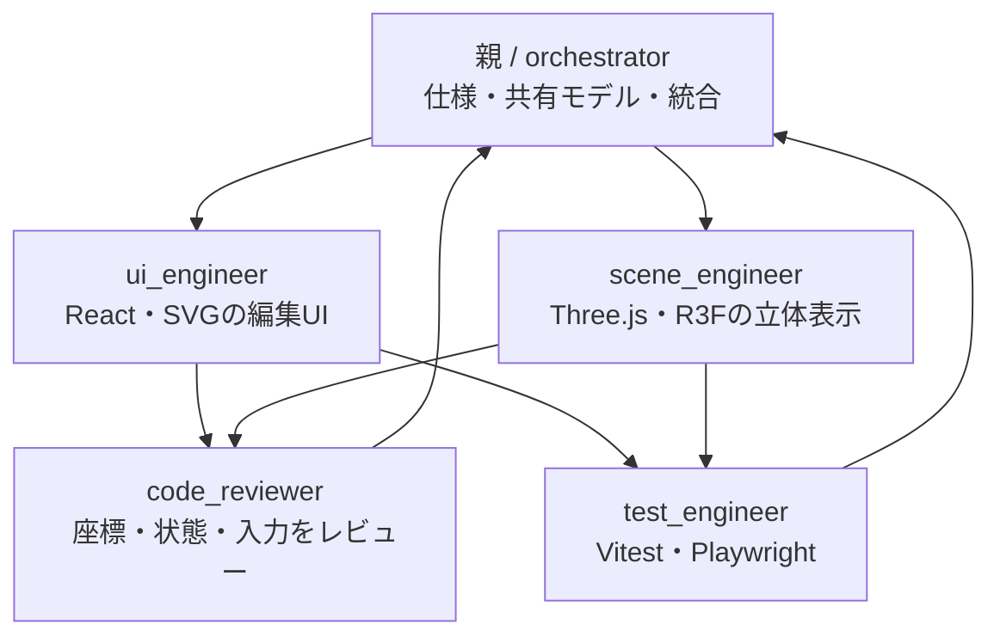

# Housemaker のオーケストレーション

`.codex/agents/` に5役割の設定を実装済みです。通常は親スレッドが統合を担当します。



同時に動かす子は最大3つです。各依頼で対象ファイルと入出力契約を指定し、同じファイルを複数担当に書かせません。設定でモデルや推論強度は固定せず、親の選択を継承します。

| 役割 | 設定ファイル | 担当 |
| --- | --- | --- |
| orchestrator | `.codex/agents/orchestrator.toml` | 仕様、共有型、依存関係、統合、最終確認 |
| ui_engineer | `.codex/agents/ui_engineer.toml` | React・SVGによる間取りと編集画面 |
| scene_engineer | `.codex/agents/scene_engineer.toml` | Three.js・R3Fによる部屋・家具・視点 |
| code_reviewer | `.codex/agents/code_reviewer.toml` | 読み取り専用のコードレビュー |
| test_engineer | `.codex/agents/test_engineer.toml` | 単体テストと実ブラウザテスト |

依頼例：

> AGENTS.mdに従い、ui_engineerとscene_engineerに独立したファイルを割り当て、実装後にcode_reviewerとtest_engineerで確認してください。

初回開発では親がUIと共通モデル、scene_engineerが3Dを実装し、レビュー担当とテスト担当が独立して確認しました。すべての担当に日本語のロジック解説コメントを要求します。

カスタム役割はクライアントが設定を読み込んだ後に利用できます。プロジェクトの新しいセッションで設定を読み込んでください。親が統合中なら別のorchestratorを重複して作りません。

## Context7

ユーザー指定により、`~/.codex/config.toml` に次の接続を登録しています。プロジェクト設定には重複登録しません。

```toml
# ライブラリの公開ドキュメントを参照するリモートMCP。
[mcp_servers.context7]
url = "https://mcp.context7.com/mcp"
```

MCP初期化、`tools/list`、`resolve-library-id`によるReact Three Fiberの検索が成功しました。匿名接続で検証しており、OAuth認証やAPIキーの保存は行っていません。通常のツールとして利用するには新しいCodexセッションを開始してください。

参照：[OpenAIのサブエージェント仕様](https://learn.chatgpt.com/docs/agent-configuration/subagents)、[Context7公式接続設定](https://context7.com/docs/resources/all-clients)。2026-09-07確認。
